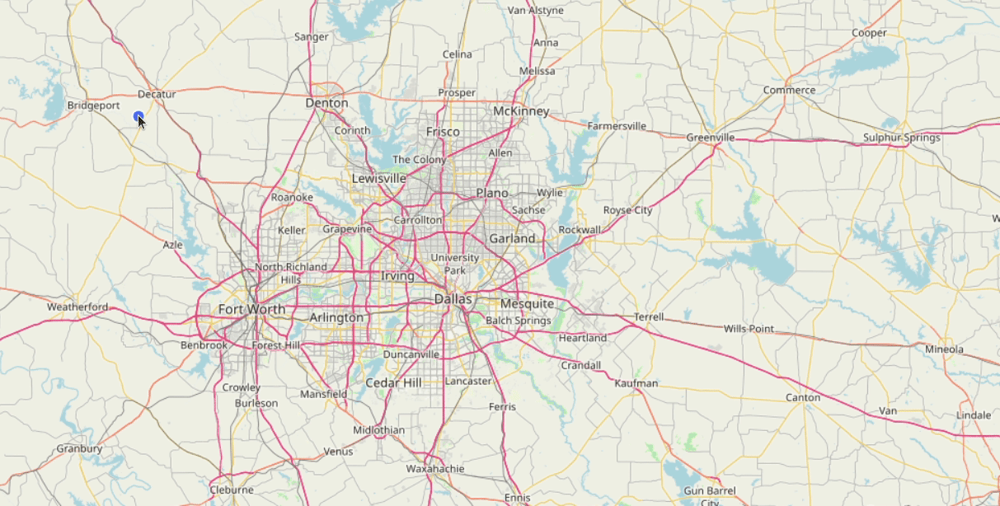

# OpenLayersDynamicMeasurement
Dynamic Measurement in OpenLayers with labels that follows changing geometry

## For tutorial post, click on following link 
[Create a DynamicMeasurement tool in OpenLayers to show measurements on labels that follow changing geometry](https://spatial-dev.guru/2021/09/05/create-a-dynamicmeasurement-tool-in-openlayers-to-show-measurements-on-labels-that-follows-2/"")
742GeHpo0C3FkcWkrb9XTGQcY5Bvt0rYHkIwZomT
8yjomm5Vn0QzCaVIHaou

Apart from the measurement tool i added the Cadastral viewe Using Naver API
